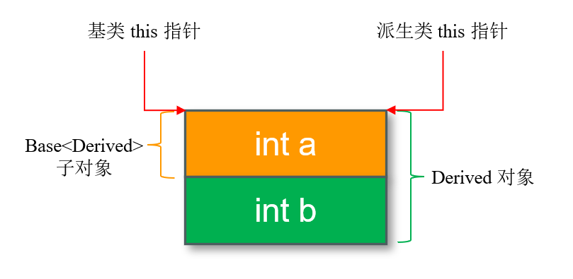
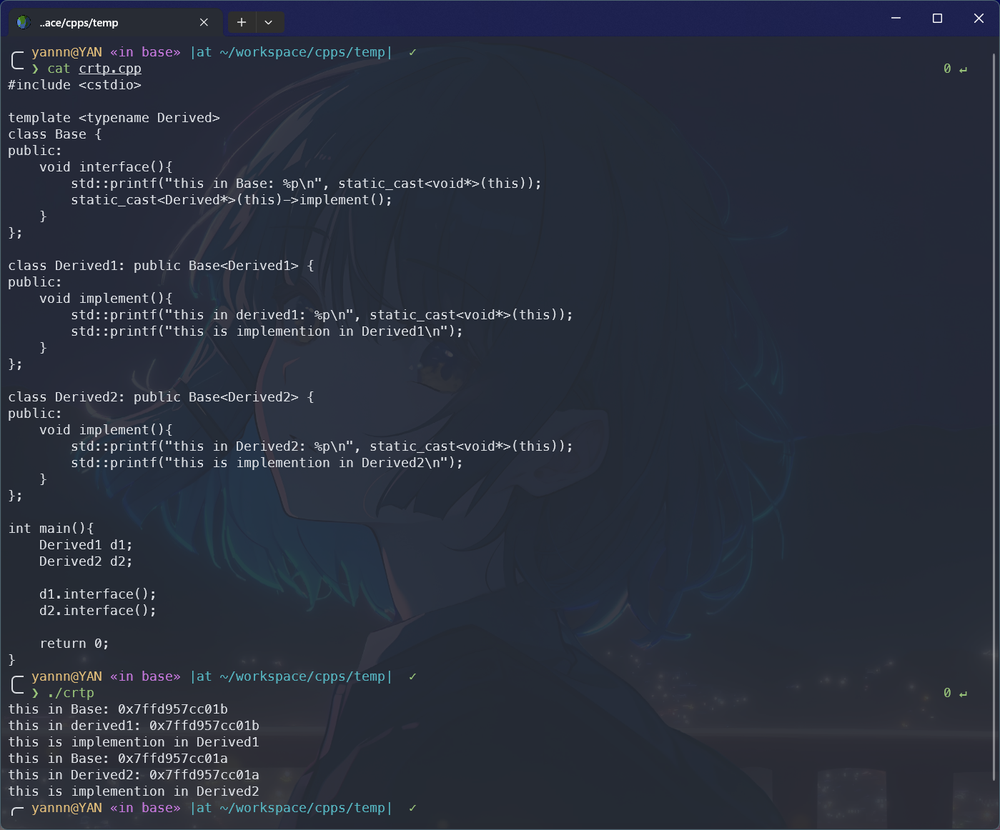
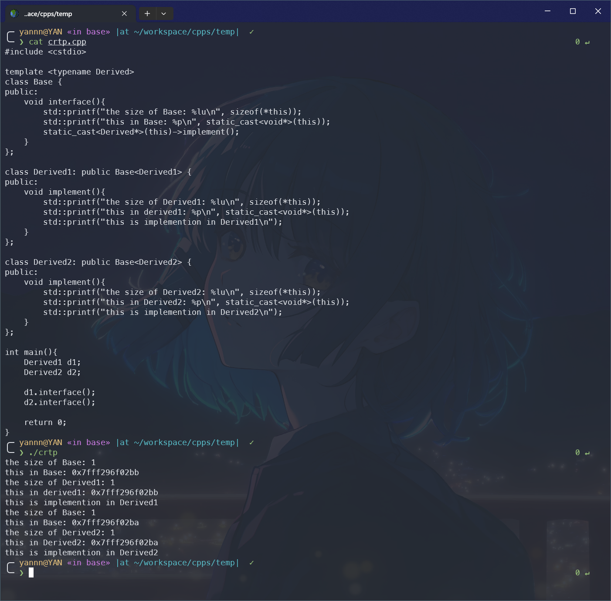

## 什么是 CRTP
&emsp;&emsp;如果熟悉 c++，那类似下面的代码一定不会陌生：
```cpp {2, 11, 19}
// 基类是模板类，模板参数为 Derived
template <typename Derived>
class Base{
public:
    void interface(){
        static_cast<Derived*>(this)->impl();
    }
};

// 派生类继承自基类 Base，并将自身作为模板参数传入
class Derived1: public Base<Derived1>{
public:
    void impl(){
        // 具体实现逻辑
    }
};

// 派生类继承自基类 Base，并将自身作为模板参数传入
class Derived2: public Base<Derived2>{
public:
    void impl(){
        // 具体实现逻辑
    }
};
```
&emsp;&emsp;这样的设计模式并不少见，常见于 c++ 标准库、llvm等注重性能开销的项目中。其最主要的特征就是：**派生类继承自一个以自身为模板参数的基类**，从而呈现出一种"**递归**"的结构，故称之为**奇异递归模板**（Curiously Recurring Template Pattern，**CRTP**）。

&emsp;&emsp;这种看似"自引用"的写法，实际上是基类能够在**编译期**获知派生类类型，从而实现静态多态、代码复用等功能，且能够避免动态多态（虚函数）带来的运行时开销的关键所在。

:::important
### 你可能会有疑惑：
1. 为什么可以将自身作为模板参数传递给模板基类？
2. 既然是"递归"，递归出口在哪？
3. 为什么基类 this 指针可以调用派生类方法？
4. 既然派生类都实现了同样的方法，为什么还需要通过基类去调用？
:::

## CRTP 原理：编译期的"类型绑定"
&emsp;&emsp;CRTP 很关键的技巧在于将派生类类型信息通过模板参数传递给了基类，让其可以能够"预知"派生类成员，从而在编译期完成函数调用的绑定。当然，你可能会疑惑，当派生类将自身作为模板参数传递给基类时，此时派生类是一个**不完整类型**，怎么确保该不完整类型是否具有相应的方法调用，如例子中的 impl ？

&emsp;&emsp;这与 c++ 模板的**两阶段名称查找**（Two-Phase Name Lookup）或**两阶段检查**机制有关。

### 模板的两阶段检查
&emsp;&emsp;c++ 中，模板编译分为两个阶段：
1. **第一阶段：模板定义时**
   此阶段，对模板的检查只停留在语法正确性上，并不会检查任何依赖模板参数的名称是否有效，如 `static_cast<Derived*>(this)->impl()`；
2. **第二阶段：模板实例化时**
   当模板被具体类型实例化时，如 `Base<Derived>`，编译器才会检查依赖于模板参数的名称是否有效。而此时，派生类的定义已确保可见，至少能够满足基类的需求，因此依赖名称才可以被正确解析。

&emsp;&emsp;基类模板的实例化不一定"准时"发生在派生类对象被创建时，而更可能在派生类定义的早期（如解析继承列表）就开始启动了，但其中**针对依赖名称（如派生类需要提供的方法）的第二阶段检查，则必然延迟到"派生类中这些依赖名称已被声明"之后（通常是派生类定义完成时）**，这种"延迟绑定"的机制确保了检查的有效性。

&emsp;&emsp;而在最初的例子中：
1. **第一阶段**
   `Base<Derived>` 中 `static_cast<Derived*>(this)->impl()` 是**依赖名称**，编译器不会检查其有效性，只检查语法是否正确，如括号是否匹配等；
2. **第二阶段**
   当 `Base<Derived>` 实例化时，编译器才会检查 `Derived` 是否真的有 `impl` 成员。而由于"延迟绑定"机制，此时 `Derived` 已经完整定义了 `impl`，自然能够通过检查。

&emsp;&emsp;上面解释了为什么能够将派生类类型作为模板参数传递给基类的同时，实际上也回答了 CRTP 的"递归出口"的问题——即 **CRTP 本质上根本不会递归**。不难发现，CRTP 这种"自我引用"的结构是**类型层面的静态关联**，而非实际的"递归过程"。

&emsp;&emsp;CRTP 的"自我引用"并不会产生"无限展开"的风险。`Base<Derived>` 的实例化依赖 `Derived` 的定义，而 `Derived` 的定义仅依赖于 `Base<Derived>` 的 "类型标识"，而非其完整展开的结果。而这种 "类型标识" 仅用于构建派生类与基类之间的继承关系，与派生类自身定义的完整性并没有直接关系，自然不会形成实际的递归引用。

&emsp;&emsp;实际上，类型层面的静态关联有很多例子，如：
```cpp {3}
struct Node {
    int val;
    Node* next;
};
```
> 怎么样，熟悉吧。

### 回到对象模型
> 为什么基类 this 指针可以调用派生类方法？

```cpp {2} "static_cast<Derived*>"
void interface(){
    static_cast<Derived*>(this)->impl();
}
```
&emsp;&emsp;最初的例子中，基类方法通过 this 指针调用了派生类中定义的方法，这是如何实现的呢？巧妙之处就在于调用前基类先将 this 指针强制转换成了派生类指针，而让我们重温 c++ 对象模型吧。

&emsp;&emsp;c++ 对象模型中，**对象内存仅存储成员变量，成员函数（包括普通函数、虚函数）则存储在代码段，并由该类的所有对象所共享**。函数逻辑对所有对象都是相同的，而无需为所有对象重复存储一个副本；而成员变量的值是对象所独有的，必须每个对象单独存储。

&emsp;&emsp;最初的例子中，无论基类还是派生类都没有成员变量，为了直观地表达，这里假设基类和派生类都各自拥有一个 int 类型的成员变量：

```cpp {5, 14, 23}
// 基类是模板类，模板参数为 Derived
template <typename Derived>
class Base{
public:
    int a;  // 添加一个成员变量
    void interface(){
        static_cast<Derived*>(this)->impl();
    }
};

// 派生类继承自基类 Base，并将自身作为模板参数传入
class Derived1: public Base<Derived1>{
public:
    int b;  // 添加一个成员变量
    void impl(){
        // 具体实现逻辑
    }
};

// 派生类继承自基类 Base，并将自身作为模板参数传入
class Derived2: public Base<Derived2>{
public:
    int b;  // 添加一个成员变量
    void impl(){
        // 具体实现逻辑
    }
};
```

&emsp;&emsp;由于 CRTP 其实是 c++ **普通单继承**的一种特殊形式，这里我们只讨论单继承的对象模型。在这种最基础的继承模型中，**派生类对象包含基类子对象和自身成员变量，布局按照"基类在前，派生类在后"的逻辑顺序排列**。以上面的例子为例：



&emsp;&emsp;对于派生类对象而言，其基类子对象的 this 指针和派生类对象自身的 this 指针指向同一内存位置，两个 this 只有类型上的区别——但决定了它们对内存的解释范围的不同。对于基类子对象的 this 指针而言，其只会将基类子对象那部分内存作为对象内存，而派生类对象的 this 指针则会将整个对象内存解释为一个派生类对象。

&emsp;&emsp;这个 this 指针的核心特性不难被验证，如：


&emsp;&emsp;可以看到，派生类 this 指针和其基类子对象的 this 指针保持一致。

&emsp;&emsp;这仍然还不够解释为什么基类可以访问派生类方法的问题。前面介绍过，对于类成员函数而言，存储于代码段，而当对象通过 this 指针调用时，实际上是根据 this 指针类型而选择对应的函数来调用的，这里的"函数选择"发生在编译期，因为 this 指针静态类型是编译期可确定的。

&emsp;&emsp;这里也就解释了，为什么基类在调用派生类指针前需要将 this 指针强制转换为派生类指针，因为它们只有类型上的区别，而通过这次转换即可调用派生类在代码段的成员函数。

&emsp;&emsp;最后补充一下，对于没有成员变量的基类和派生类，派生类对象只包含基类子对象，而基类子对象内存大小为 1 字节，这是由 c++ **"空基类优化"**（Empty Base Class Optimization，**EBCO**）机制决定的。验证一下：




## 为什么使用 CRTP？
&emsp;&emsp;回到前面的问题中来，既然派生类都严格实现了统一的成员方法，我们完全可以直接通过派生类调用，而为什么需要向上调用基类接口，再回调派生类成员函数呢？此时的调用路径为：

```
派生类对象 -> 基类接口 ->  回调派生类实现
```

&emsp;&emsp;其实这里以下几方面的优势：

### 1. 零开销的静态多态能力
&emsp;&emsp;CRTP 通过**编译期类型绑定**来实现多态，这与通过使用虚函数实现的动态多态不同，完全规避了后者运行时开销。你可能会质疑，动态多态通过"运行时绑定"可以让基类指针向下调用派生类方法，调用路径为：

```
基类指针 -> 派生类方法
```

CRTP 无法实现类似的通过基类指针批量处理不同派生类的需求。其实不然，比如：
```cpp
// 模板函数，接受任一 CRTP 派生类，调用其接口
template <typename Derived>
void callf(Base<Derived>& base){
    base.interface();   // 编译期通过 Derived 的类型绑定到对应的 impl
}

int main(){
    Derived1 d1;
    Derived2 d2;

    call(d1);
    call(d2);

    return 0;
}
```
&emsp;&emsp;同样，CRTP 可以实现类似动态多态的批量处理不同派生类对象的需求，你可能会疑惑，为什么 `call(Base<Derived>& base)` 可以接受一个 `Base<Derived>` 的派生类作为参数。实际上，在 c++ 继承体系中，**派生类对象可以隐式转换为其基类的引用**。可以验证一下：


&emsp;&emsp;基于 CRTP 实现静态多态的方式，由于无需虚函数表（vtable）和虚函数指针（vptr），能够减少内存占用，无额外指针开销。此外，由于在编译期直接绑定到具体实现，避免了运行时查表和间接调用，提升了运行性能。

### 2. 高效的代码复用（Mixins 模式）
&emsp;&emsp;除此之外，CRTP 可作为 "混入类"（Mixins），**将通用逻辑封装在基类中，而派生类只需要实现差异化细节，避免重复编码**。

&emsp;&emsp;想象一下，如果直接通过派生类对象调用方式调用统一实现的方法，会在不同派生类之间重复实现本身通用的代码逻辑，比如：
```cpp {12, 20}
template <typename Derived>
class Base{
public:
    void interface(){
        static_cast<Derived*>(this)->impl();
    }
};

class Derived1{
public:
    void impl(){
        // 通用逻辑
        // 差异逻辑
    }
};

class Derived2{
public:
    void impl(){
        // 通用逻辑
        // 差异逻辑
    }
};

int main(){
    Derived1.impl();
    Derived2.impl();

    return 0;
}
```

&emsp;&emsp;而 CRTP 的方式却更加优雅，基类模板中定义通用功能，而所有派生类自动复用，无需在每个类中重复实现。不仅如此，面临修改时，**通用逻辑的修改也只需在基类中进行，所有派生类自动生效，能够大幅降低维护成本，符合 DRY 设计原则**。

:::tip
**DRY 原则**：Don't Repeat Yourself（不要重复自己）
即，系统中的每一段逻辑，每一份知识都应该有且仅有一个权威的、唯一的表示，避免在多个地方重复出现。
:::

### 3. 编译期接口检查与类型安全
&emsp;&emsp;相较于动态多态运行时检查，CRTP 将接口的检查提前到了编译期，减少运行时错误。当基类回调派生类方法时，若派生类并未定义该方法，则会在编译期报错。

:::important
总而言之，CRTP 以编译期计算为代价，换取零运行时开销的多态能力、高效的代码复用和编译期安全。适合性能敏感、功能复用要求高且无需运行时动态切换行为的场景。
:::